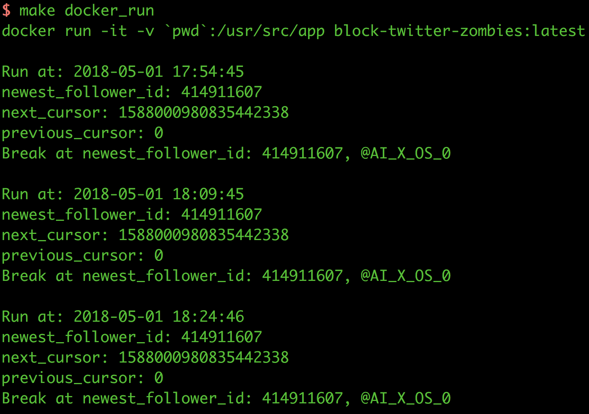
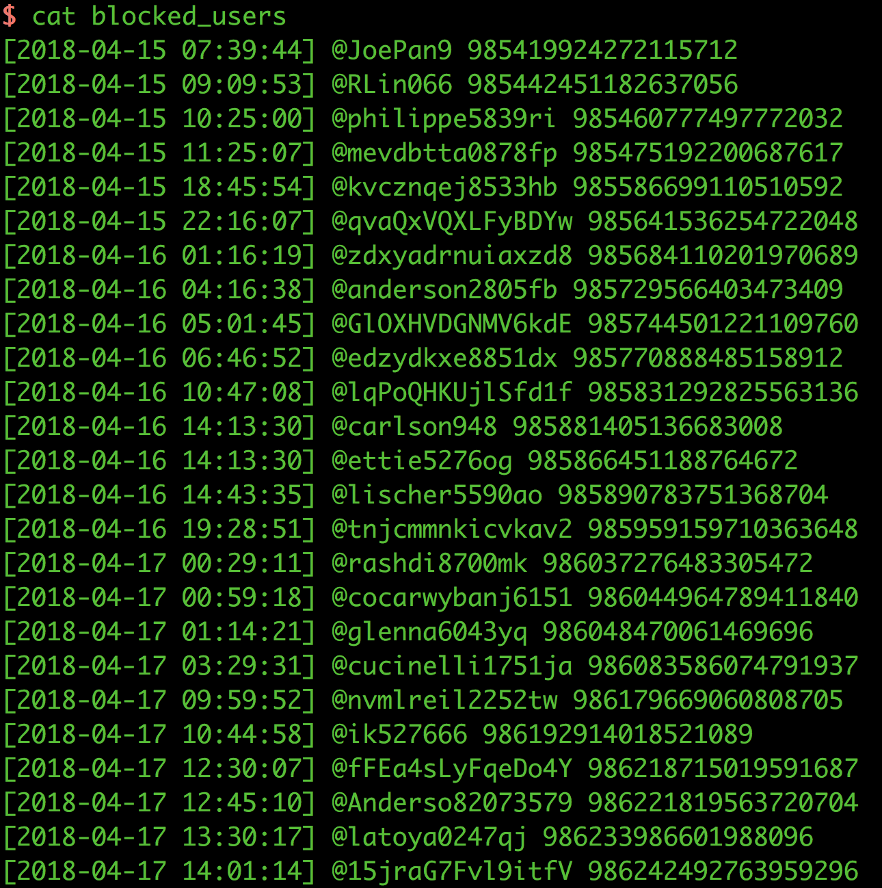

# block-twitter-zombies

A personal daemon to block your zombie Twitter followers.

---

## Requirements

Docker or (Python >= 3.6 and (pip or pipenv))

---

## Installation

`git clone https://github.com/M157q/block-twitter-zombies.git`

---

## Configuration

+ `cp config.example.py config.py`
+ Modify the content of `config.py`
    + Fill in `TWITTER_CONSUMER_KEY`
    + Fill in `TWITTER_CONSUMER_SECRET`
    + Fill in `TWITTER_ACCESS_TOKEN_KEY`
    + Fill in `TWITTER_ACCESS_TOKEN_SECRET`

+ If you don't know these 4 values above:
    + If you haven't create any Twitter application, create one at here: <https://apps.twitter.com/app/new>
+ At <https://apps.twitter.com/app>, click your Twitter app which you gonna use.
+ Click "Keys and Access Tokens" section of the current app:
    + Make sure the "Access Level" of the app has at least read and write permission.
    + Copy the value of "Consumer Key (API Key)" to `TWITTER_CONSUMER_KEY` in `config.py`
    + Copy the value of "Consumer Secret (API Secret)" to `TWITTER_CONSUMER_SECRET` in `config.py`
+ Create an access token if you don't have one.
    + Make sure the "Access Level" of the access token has at least read and write permission.
    + Copy the value of "Access Token" to `TWITTER_ACCESS_TOKEN_KEY` in `config.py`
    + Copy the value of "Access Token Secret" to `TWITTER_ACCESS_TOKEN_SECRET` in `config.py`

---

## Usage

+ Docker
    + `make docker_build`
    + `make docker_run`
+ Python >= 3.6:
    + pip
        + `pip install -r requirements.txt`
        + `python main.py`
    + pipenv
        + `pipenv install`
        + `pipenv run python main.py`

---

## Screenshots

Logs

Blocked Users

